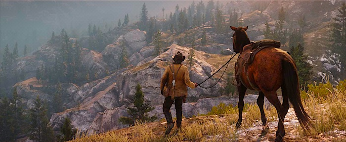

# Travelmania

## Installation

- installe Docker sur ta machine (voir [ici](https://docs.docker.com/get-docker/))
- clone ce projet sur ton poste
- crée une branche pour pouvoir push ton rendu par la suite
- ⚠️ ne surtout pas push sur la branche `main`
- lance un `cp .env.development .env`
- lance un `composer install`
- lance un `yarn install`

## Run

- lance l'environnement de développement avec `./vendor/bin/sail up -d`
- stoppe l'environnement de développement avec `./vendor/bin/sail stop`
- lance ta migration de base de données avec `./vendor/bin/sail artisan migrate --seed`
- Si tu veux ouvrir ta BDD avec ton outil (Workbench, TablePlus, HeidiSQL...), ce sera avec les identifiants suivants :
  - host : `127.0.0.1`
  - port : `3306`
  - user : `sail`
  - pwd : `password`
  - bdd : `laravel`
- L'URL du projet est la suivante : <http://127.0.0.1/>

## Exercice

Ta mission est de développer une interface de gestion de voyages (Travelmania ⛵️) permettant :

- De créer un voyage et ses différentes étapes (train, avion, voiture, etc.)
- De lister les voyages et leurs étapes
- de supprimer une étape pour un voyage

## Réalisation

- Les données `DOIVENT` être stockées en BDD avec des données de ce genre :
  - [voyage1](./resources/json/voyage1.json)
  - [voyage2](./resources/json/voyage2.json)
- La BDD `DOIT` être créée via un laravel migrate et peuplée via un seeding
- le rendu `DOIT` avoir quelques tests unitaires.
- le code envoyé via le front-end `DOIT` être vérifié côté back-end
- bonus 🍿: le rendu `PEUT` avoir un frontend qui se build avec [Vite](https://laravel.com/docs/9.x/vite)
- bonus 🍿: le rendu `PEUT` être fait avec ReactJS ou VueJS
- bonus 🍿: le rendu `PEUT` contenir une authentification
- bonus 🍿: le rendu `PEUT` contenir une gestion de permissions

À toi de jouer 😉!
